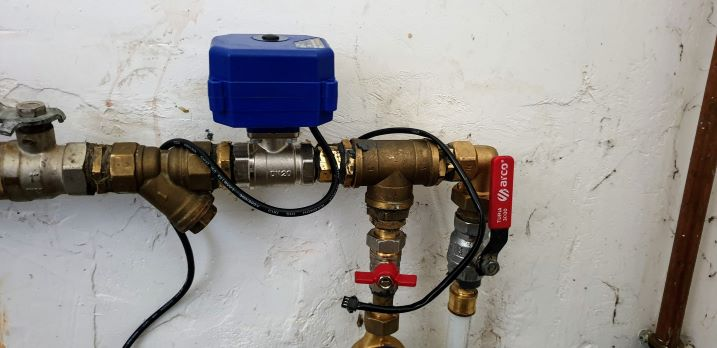
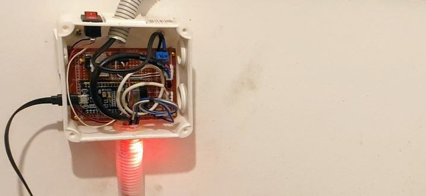
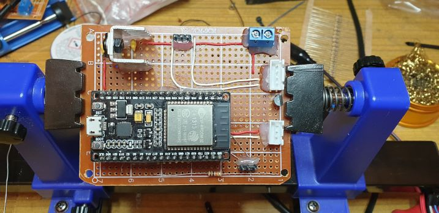
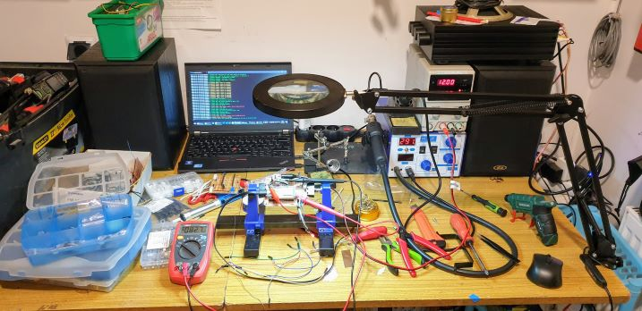
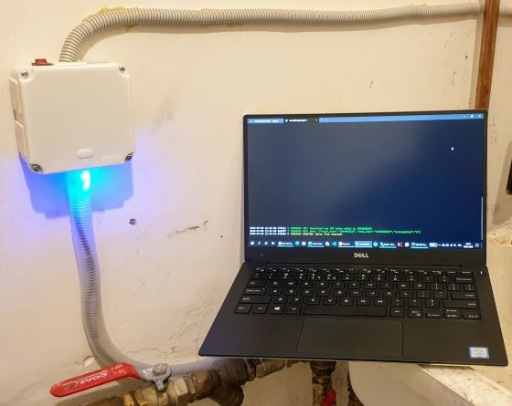
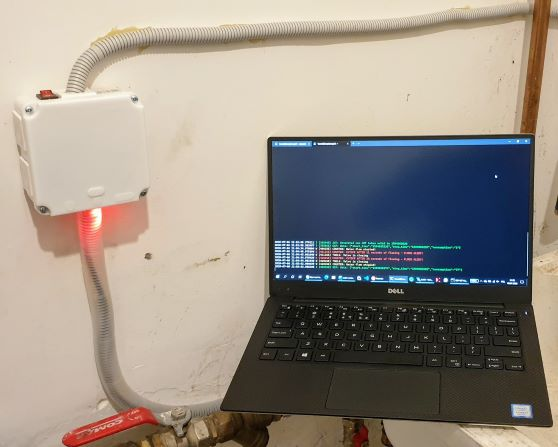
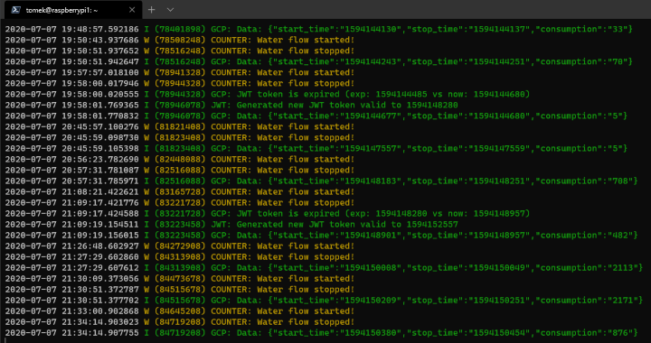
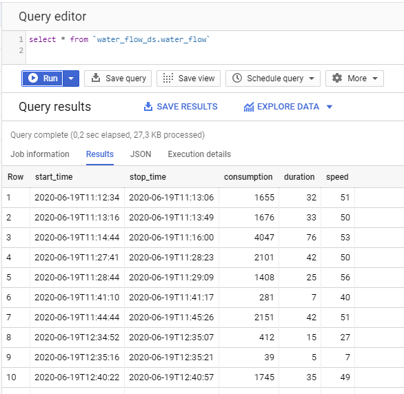
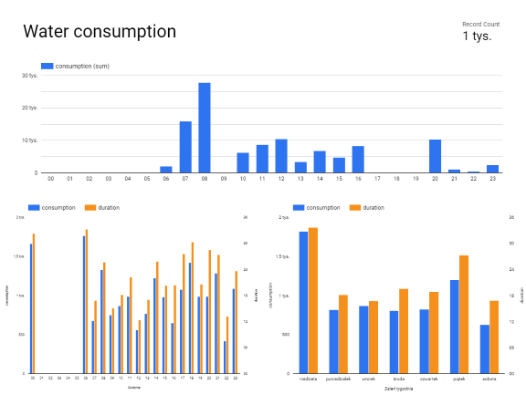

# Smart Anti-Flood System
This is a kind of ~~magic~~ home anti-flood system. 

It contains valve with actuator, hall sensor as a flow meter and ESP32 as a main microcontroller. 
Water flow is continuously measured and on *some conditions* ESP32 decides when to close the main valve.
It may depend either on fixed rules (e.g. flow speed/duration) or anomaly detection algorithm. 

## Features
- installed on main water connection it measures consumption amount and flow duration
- telemetry (start time, water consumption amount, flow duration and speed) is on-the-fly sent to the cloud (Google Cloud Platform) for further processing and analysing
- in case of anomaly detection main valve is closing to prevent flooding
- user is notified about all events and can decide whether open or close the main valve remotely
- collected data may be used to
  - make an analysis that helps to **save more water**
  - learn model of typical water usage and improve anomaly detection algorithm
  - generate beautiful reports e.g. on Google Data Studio
- Over-The-Air firmware updates
- Simple web interface & api (tbd)
- Strong security (PKI, TLS, JWT)  

## Hardware
|  | 
|:--:| 
| *3/4" valve with actuator and flow meter (hall sensor)* |

|  |
|:--:| 
| *Control Unit* |

## Software
### Tech stack
- languages: C, Python 
- sdk: xtensa-esp32-elf
- framework: [esp-idf](https://docs.espressif.com/projects/esp-idf/en/latest/esp32/) including [FreeRTOS](https://www.freertos.org/) - Real-time operating system for microcontrollers  
- tools: cmake, ninja, git
- security: 
  - [JSON Web Tokens](http://jwt.io/)
  - [mbed TLS](https://tls.mbed.org/)
- communication: REST API
- Over-The_Air solution: [ota-server](https://github.com/tomekceszke/ota-server)
- cloud solution: [Google Cloud Platform](https://cloud.google.com/): IoT Core, Pub/Sub, Dataflow, BigQuery
- reporting: [Google Data Studio](https://datastudio.google.com/) 

### 3rd Party Components
- udp-logging - https://github.com/MalteJ/embedded-esp32-component-udp_logging - Apache License v2.0
- base64 decoder - https://github.com/zhicheng/base64 - Public Domain
- esp-idf examples - https://github.com/espressif/esp-idf/tree/master/examples - Apache License v2.0

## Assembling

|  |
|:--:| 
| *Main micro-controller: ESP-WROOM-32 dev kit* |

|  |
|:--:| 
| *Measuring and testing* |

## Testing

|  |
|:--:| 
| *Water is flowing* |

|  |
|:--:| 
| *Protection activated* |

|  |
|:--:| 
| *Device's logs* |

## Collecting and analyzing data
|  |
|:--:| 
| *Collected data on Google BigQuery database* |

|  |
|:--:| 
| *Sample report on Google Data Studio* |

## TODO
* implement standalone, local algorithm for [anomaly detection using the multivariate gaussian distribution](https://www.coursera.org/lecture/machine-learning/anomaly-detection-using-the-multivariate-gaussian-distribution-DnNr9) - like in my other project https://github.com/tomekceszke/ml-login...
* ... or use GCP solution https://cloud.google.com/ai-platform/docs/getting-started-tensorflow-estimator 
* improve logging (store locally on NVS and on the cloud https://cloud.google.com/iot/docs/how-tos/device-logs?hl=en_US) ✔
* prepare basic web interface (status, open/close valve)
* send state to the cloud https://cloud.google.com/iot/docs/how-tos/config/getting-state?hl=en_US#http_bridge
* allow to control device from the cloud (https://cloud.google.com/iot/docs/how-tos/config/configuring-devices?hl=en_US and https://cloud.google.com/iot/docs/how-tos/commands?hl=en_US)
* optimize cloud costs (decrease equipment availability and performance etc...) ✔
* mobile app - send push notification with option to open the valve
* hardware - add reset button on case 
* fix memory leaks ( ͡° ͜ʖ ͡°) ✔