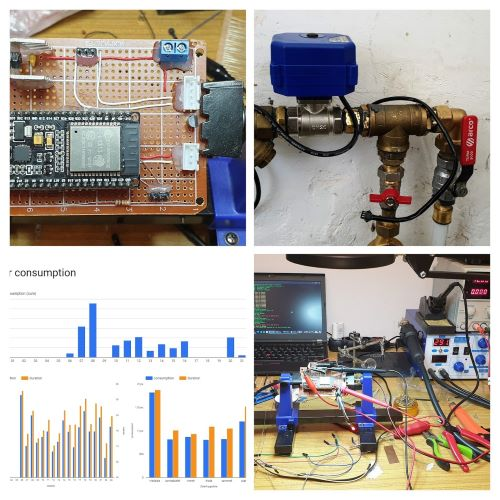
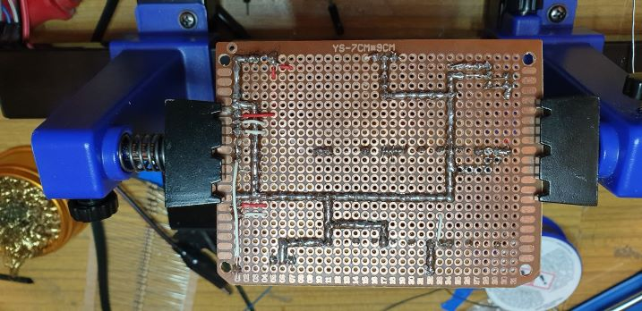

# Anti-flood system

## Hardware

*Valve with actuator and hall sensor as a flow meter*

*PCB's front...*

*... and back*

## Software
tbd

### 3rd Party Components
- udp-logging - https://github.com/MalteJ/embedded-esp32-component-udp_logging - Apache License v2.0
- base64 decoder - https://github.com/zhicheng/base64 - Public Domain
- esp-idf examples - https://github.com/espressif/esp-idf/tree/master/examples - Apache License v2.0

## Testing

*Testing PCB "on the desk"*

*Water is flowing*

*Protection activated*