# water-controller

**A home anti-flood valve that has been guarding a house's main water inlet since 2020.**

An ESP32 counts pulses from a flow meter and closes a motorised ball valve when water runs longer than it should.
Over six years it stopped several real leaks, mostly garden hoses left open or bursting in the summer heat. Version 3
rebuilds it around one rule: **the shut-off must work even when everything else is broken**.

<table>
  <tr>
    <td width="50%">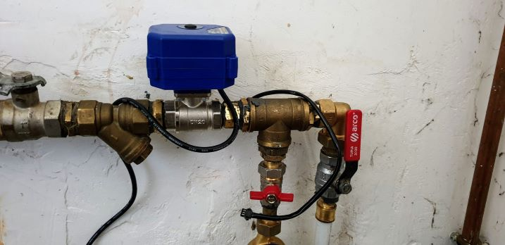</td>
    <td width="50%">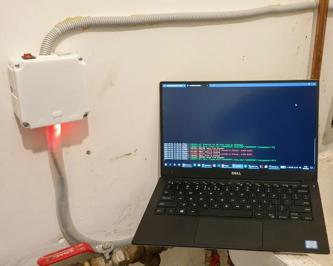</td>
  </tr>
  <tr>
    <td align="center">Valve actuator and flow meter on the main inlet</td>
    <td align="center">Control unit after a shut-off (red LED)</td>
  </tr>
</table>

<p align="center">
  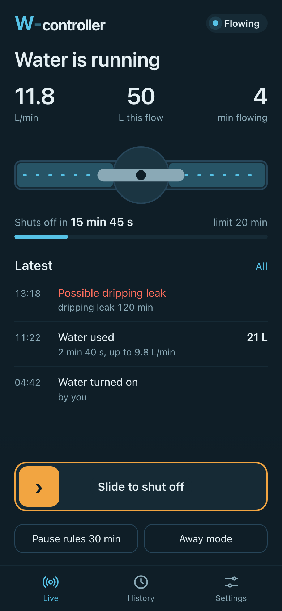
  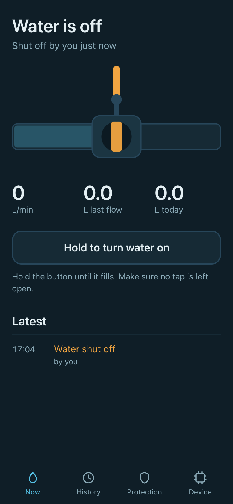
  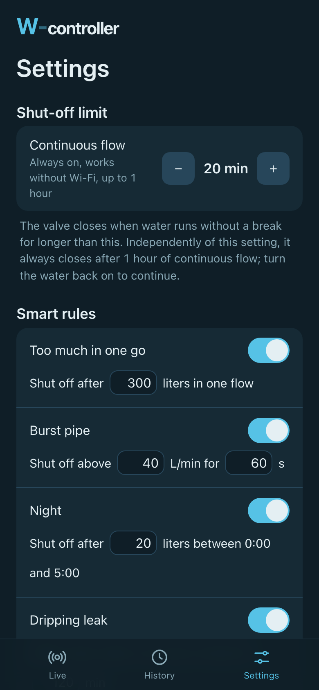
  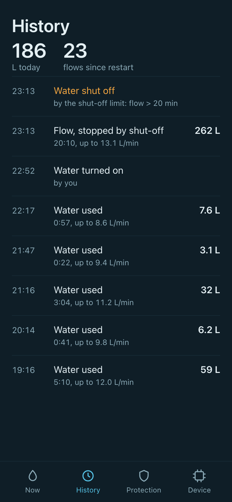
</p>

<p align="center"><sub>Screenshots of the device's web app, rendered with sample data.</sub></p>

## What it does

- **Measures every flow**: liters, duration, rate (Hall-effect meter, 410 pulses per liter, measured against the house water meter).
- **Shuts the water off** after continuous flow longer than a limit set in the app. This works with no Wi-Fi, no server and no clock.
- **Smart rules**:
  - too much water in one go;
  - burst pipe (a very high rate);
  - use at night;
  - a dripping leak that never stops;
  - an "away from home" mode.
  Rules can be paused while watering the garden.
- **Keeps the valve where it was** across reboots, power cuts and firmware updates.
- **iPhone home-screen app** served by the device:
  - live flow and a countdown to shut-off;
  - slide to shut the water off or turn it back on;
  - history, settings, pulse-signal diagnostics.
- **Push notifications** ([ntfy](https://ntfy.sh)) for shut-offs, leaks and a valve that does not close.
- **History and analytics** on a home server (MQTT → PostgreSQL), including six years imported from Google BigQuery.
- **Safe over-the-air updates** with automatic rollback. A one-shot migrator moved the sealed production board to a new bootloader
  and partition table without opening the box, after a rehearsal on a spare board ([docs/IDF5_MIGRATION.md](docs/IDF5_MIGRATION.md)).

## Protection tiers

The design rule for every line of code: the core function must survive failures of everything around it.

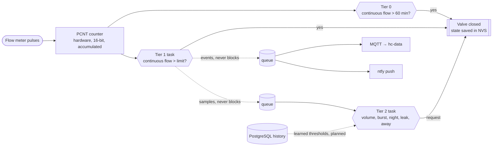
```mermaid
flowchart LR
    meter([Flow meter pulses]) --> pcnt[PCNT counter<br/>hardware, 16-bit, accumulated]
    pcnt --> t0{{"Tier 0<br/>continuous flow > 60 min?"}}
    t0 -- yes --> valve
    pcnt --> t1{{"Tier 1 task<br/>continuous flow > limit?"}}
    t1 -- yes --> valve[[Valve closed<br/>state saved in NVS]]
    t1 -. samples, never blocks .-> q1[(queue)]
    q1 --> t2{{"Tier 2 task<br/>volume, burst, night, leak, away"}}
    t2 -- request --> valve
    t1 -. events, never blocks .-> q2[(queue)]
    q2 --> mqtt[MQTT → hc-data]
    q2 --> ntfy[ntfy push]
    server[(PostgreSQL history)] -. learned thresholds, planned .-> t2
```

| | Tier 0 | Tier 1 | Tier 2 |
|---|---|---|---|
| Rule | 60 min of continuous flow, **hard-coded** | Continuous flow longer than the limit set in the app (1 min–1 h) | Volume per flow, burst rate, night window, micro-leak notice, away mode |
| Can be changed | never: no setting, API, snooze or NVS value touches it | from the app, clamped | from the app, can be paused |
| Depends on | nothing; own flow tracking in the watchdog-guarded flow task | nothing: own task on core 1, monotonic clock, no network, no allocation, never waits on a queue | local clock for the night rule |
| If it fails | the task watchdog resets the device; the valve state is restored from NVS | same | Tier 1 and Tier 0 are unaffected (verified with the Tier 2 task suspended) |

Tier 0 guards against anything going wrong with Tier 1 (a bad setting, a bug in its logic or in storage). A long,
legitimate fill (a pool) just means turning the water back on in the app once an hour.

All tiers are pure C modules (`tier0.c`, `tier1.c`, `rules.c`) with host unit tests.
- On the spare board, a test build drives pulses into the meter input.
- `tools/hw_test.py` then checks 37 things end-to-end, including Tier 1 closing the valve with Wi-Fi switched off and Tier 0 closing it again after a reopen.
- Details: [docs/TESTING.md](docs/TESTING.md).

## Architecture

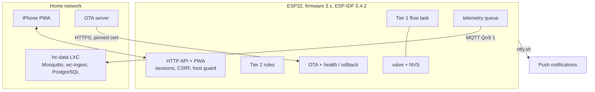
```mermaid
flowchart TB
    subgraph device[ESP32, firmware 3.x, ESP-IDF 5.4.2]
        tier1[Tier 1 flow task] --- valve[valve + NVS]
        tier2[Tier 2 rules]
        api[HTTP API + PWA<br/>sessions, CSRF, host guard]
        tele[telemetry queue]
        ota[OTA + health / rollback]
    end
    subgraph lan[Home network]
        phone[iPhone PWA]
        hc[hc-data LXC<br/>Mosquitto, wc-ingest, PostgreSQL]
        otas[OTA server]
    end
    phone <--> api
    tele -- MQTT QoS 1 --> hc
    otas -- HTTPS, pinned cert --> ota
    device -- ntfy.sh --> push[Push notifications]
```

The ESP-IDF plumbing shared with my other controllers (gate, heating, floor heating) lives in a separate component,
**home-idf**:
- Wi-Fi that joins the strongest AP;
- UDP logging;
- NTP, OTA;
- health verification and rollback;
- ntfy;
- web auth and API guards;
- the OTA migrator.

## Security

The device sits on a LAN and is used from a phone, so it follows the same model as the garage gate controller.

- **Login**: PBKDF2-SHA256 password hash in firmware. Sessions are persisted in NVS with only the SHA-256 of the token stored. The cookie is `HttpOnly; SameSite=Strict`. Failed logins back off exponentially.
- **Every state change** needs a session, a JSON body, a CSRF token (HMAC of the session) and an `Origin` equal to `Host`.
- **Host allowlist** blocks DNS rebinding. CSP and `X-Frame-Options: DENY` are set, and CORS is off.
- **Without a session** the device serves only a neutral sign-in page.
- **OTA** comes over HTTPS with a pinned server certificate. Admin endpoints for scripts use a separate constant-time header check.
- **No secrets in the repository** (`credentials.h`, certificates and server secrets are gitignored).

## Data

Every flow, valve change and rule trigger goes to a PostgreSQL database on a small home server. The history from the
previous cloud setup (269 518 flows since June 2020) was imported with a correction for a bug in the old firmware:
- its 16-bit counter wrapped and added about 32 767 pulses to 4 020 flows;
- that inflated total use by 30 %: 910 m³ raw vs 634 m³ corrected.

<picture>
  <source media="(prefers-color-scheme: dark)" srcset="docs/img/usage-by-hour-dark.png">
  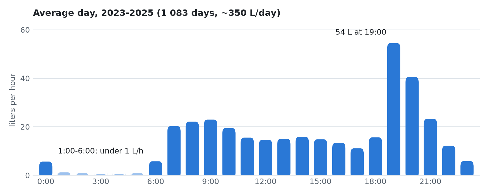
</picture>

The quiet nights make the anomaly idea concrete: water running at 3 am is rarely legitimate. Learning such baselines
from this history and feeding the thresholds back to Tier 2 is the next step.

## Hardware

| Part | |
|---|---|
| Controller | ESP32-WROOM-32 DevKit on a prototype board, sealed enclosure |
| Flow meter | Termipol PM-3/4-B, DN20 brass, Hall sensor, open collector, 2–45 L/min ([datasheet](docs/datasheet-flow-meter-pm3-4-b.pdf)) |
| Valve | DN20 ball valve with HP Control A80 4-wire 9-24 V DC actuator: contact closed = open, < 10 s travel, manual override ([manual](docs/Manual_A80_4-wires_9-24VDC.pdf)) |
| GPIO | 4 = meter (PCNT), 14 = valve, 32 = blue LED (flow), 33 = red LED (closed) |

What the actuator does during a reset or power loss, and how that shapes the firmware: [docs/HARDWARE.md](docs/HARDWARE.md).

<table>
  <tr>
    <td width="50%">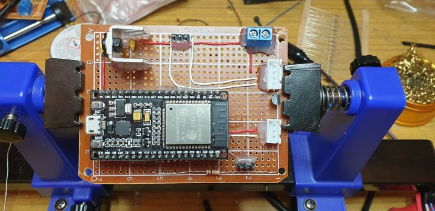</td>
    <td width="50%">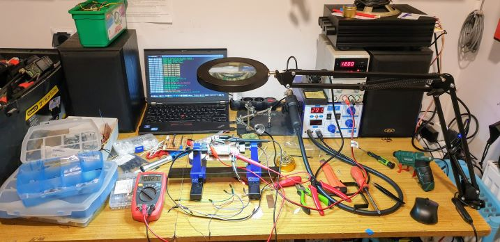</td>
  </tr>
</table>

## Repository

```
firmware/      ESP-IDF 5.4.2 firmware 3.x (C): tiers, valve, telemetry, API, PWA (web/), host tests (test/)
migrator/      one-shot OTA image that moves the legacy board to the new bootloader and partition table
server/        hc-data backend: MQTT ingest, PostgreSQL schema and views, BigQuery history import
tools/         hardware test, UI dev proxy, release build
docs/          inventory of the legacy firmware, hardware, calibration, testing, migration
```

## Build

```sh
cp firmware/main/config/credentials-example.h firmware/main/config/credentials.h   # Wi-Fi, password hash, MQTT, ntfy
firmware/build.sh                          # ESP-IDF 5.4.2
cmake -S firmware/test -B build-test && cmake --build build-test && ctest --test-dir build-test
tools/build_release.sh                     # firmware + migrator images with sha256
```

Setup details, the HTTP API and MQTT topics: [CLAUDE.md](CLAUDE.md) (the project guide) and [server/README.md](server/README.md).

## History

- **2020**: first version: ESP-IDF 4, cutoff after 20 minutes of flow, telemetry to Google Cloud (IoT Core, then Cloud Functions and BigQuery) with Data Studio reports.
- **2022–2023**: ESP-IDF 5.1, new PCNT driver, simple web page.
- **2026, version 3**:
  - protection tiers;
  - valve state that survives restarts;
  - shared home-idf framework;
  - PWA;
  - local MQTT/PostgreSQL instead of the cloud;
  - over-the-air migration to ESP-IDF 5.4.2 with rollback.

Findings about the legacy firmware that drove these changes are in [docs/INVENTORY.md](docs/INVENTORY.md).

## License

MIT
