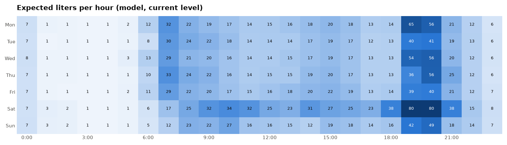
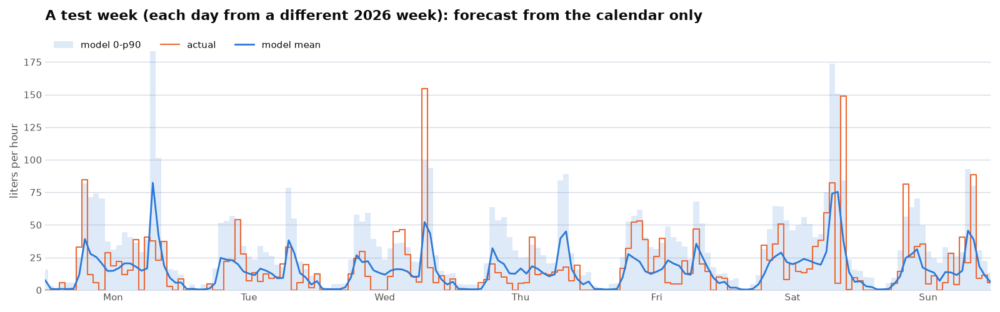
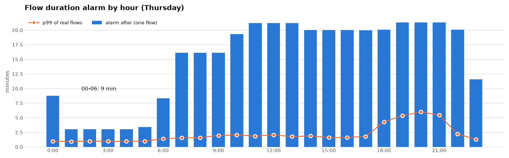

# Water usage model and anomaly detection

Stage 7, offline part: a model of normal water use learned from the flow history on hc-data, and an anomaly
detector calibrated on it. Nothing here touches the device or its protection tiers; the thresholds are an
input for a later Tier 2 / server-side alert step. Generated by `server/model/report.py` from the outputs of
`train.py` and `anomaly.py` (2026-09-29); how to run it: `server/model/README.md`.

## Answers first

- **Thursday 17:00**: expected **13 L** in the hour (median 9 L, 90 % of such hours below 29 L), 3.4 flows.
- **A 15 min flow at 03:00** is an anomaly: at night one flow alarms after **3 min** or 20 L. On the test year every injected 6 L/min x 15 min flow at Tuesday 03:00 was caught, after 3.0 min.
- **False alarms**: 0.95 per month on the test period (0.35 on validation, where the thresholds were set).

## Data

- 271,003 flows from 2020-06-19 to 2026-09-29: 269,551 from the legacy firmware (via BigQuery), 1,452 from firmware 3.x.
- One row per hour (55,044 hours, Europe/Warsaw calendar on a UTC grid, so DST neither drops nor doubles an hour). A flow crossing an hour boundary is split in proportion to time.
- Masked, never counted as zero use:
  - **telemetry gaps** longer than 24 h without a single flow (7,372 hours, mostly 2022);
  - **known unusual events** (2,539 hours, `server/model/known_events.csv`): the 2023 lawn watering while it was established, and the long flows that look like pool filling or the burst garden hose.
- **Legacy counter wrap** (docs/INVENTORY.md #6): each wrap added ~80 L. The import fixed only flows above the meter maximum (49.5 L/min); firmware 3.x never averages more than ~26 L/min (peak `max_lpm` 26.4), so any legacy flow averaging more loses the fewest wraps that bring it under (443 flows, 37 m³). Durations and counts are not affected; volumes of long legacy flows remain the least certain part of the data.
- Flows under 0.1 L are left out of counts and per-flow models: firmware 3.2.1+ does not publish them, while 27 % of legacy flows are that small.

## Split

Time-ordered, no shuffling (neighbouring hours are correlated, a random split leaks the answer):

| Set | Period | Usable hours | Used for |
|---|---|---|---|
| train | 2020-06-19 .. 2024-12-31 | 30,615 | fitting candidates |
| validation | 2025-01-01 .. 2025-12-31 | 8,389 | choosing model, training window, level correction, quantile models and all alarm thresholds |
| test | 2026-01-01 .. 2026-09-28 | 6,144 | one final evaluation, after refitting on train + validation |

The models used from now on are refitted on all usable data.

## Hourly usage model

Features are the calendar only, so a forecast exists for any future hour: hour, weekday, Polish public holiday, bridge day, and optionally the season (day of year as sin/cos). Candidates:

- **B0** mean per hour of week, what the `usage_hour_of_week` view already gives (baseline);
- **B1** B0 with holidays treated as Sundays;
- **M1** Poisson GLM on hour-of-week dummies;
- **M2** gradient boosting (Poisson loss) on the calendar features.

Two hyperparameters on top: the start of the training window (2020-06, 2022-09, 2024-01, or all data with a 2-year half-life) and a **level correction** that scales the forecast by actual / predicted over the preceding 28 or 56 days. Use grows about 10 % a year (~10.5 m³/month in 2024, ~12.5 in 2026) and a calendar cannot know that.

Best of each model on validation (liters per hour):

| Model | Window | Level | Poisson deviance | MAE |
|---|---|---|---|---|
| M2 GBM (15 leaves, 300 it) | 2024-01 | 28 | 16.597 | 12.02 |
| M2 GBM (31 leaves, 300 it) | 2024-01 | 56 | 16.668 | 12.01 |
| M2 GBM (15 leaves, 600 it) | 2024-01 | 56 | 16.672 | 12.00 |
| M1 Poisson GLM | 2024-01 | 28 | 16.683 | 12.04 |
| M1 Poisson GLM + season | 2024-01 | 28 | 16.684 | 12.04 |
| B1 + holidays as Sunday | 2024-01 | 28 | 16.690 | 12.04 |
| B0 hour-of-week mean | 2024-01 | 28 | 16.722 | 12.06 |
| M2 GBM + season (15 leaves, 300 it) | 2020-06 weighted | 28 | 16.778 | 12.09 |
| M2 GBM + season (15 leaves, 600 it) | 2020-06 weighted | 28 | 16.778 | 12.09 |
| M2 GBM + season (31 leaves, 300 it) | 2020-06 weighted | 28 | 16.838 | 12.11 |

(Every model is shown with its best window and level correction; the B0 row in the test table below is the plain view: all history, no correction.)

Chosen: **M2 GBM (15 leaves, 300 it)**, window from 2024-01, level over 28 days, no season. For flows per hour the same model wins (M2 GBM (15 leaves, 300 it), level 56 days).

Test (2026), refitted on train + validation:

| Liters per hour | Poisson deviance | MAE | RMSE | Daily MAE (L) | Mean predicted / actual |
|---|---|---|---|---|---|
| B0 hour-of-week mean | 22.20 | 13.57 | 28.1 | 132 | 13.4 / 17.7 |
| chosen model | 19.94 | 14.12 | 27.4 | 110 | 17.7 / 17.7 |
| chosen model + lags (comparison) | 19.91 | 13.40 | 27.1 | 110 | 15.3 / 17.7 |

| Flows per hour | Poisson deviance | MAE | RMSE | Daily MAE | Mean predicted / actual |
|---|---|---|---|---|---|
| B0 hour-of-week mean | 3.68 | 2.98 | 4.5 | 22 | 4.1 / 4.4 |
| chosen model | 3.38 | 2.87 | 4.3 | 21 | 4.4 / 4.4 |

What that means:

- Deviance is 10 % lower than the baseline and the daily error drops from 132 to 110 L. Almost all of the gain is the level correction: B0 under-predicts 2026 by 24 %.
- Hour-level MAE barely moves (it rewards the median, and the median hour is quiet). One hour of a household is mostly noise around a stable weekly shape; the model knows the shape, not whether someone showers at 17:00 or 17:40.
- The season does not help (every candidate got worse with it), as expected once the lawn is excluded.
- Lags (same hour a week ago, last 24 h) give about the same as the level correction, but they only exist for the next hour, not for "Thursday 17:00".
- Prediction intervals hold on test: 89.7 % of hours fall under p90 and 98.6 % under p99.

<picture>
  <source media="(prefers-color-scheme: dark)" srcset="img/model-heatmap-dark.png">
  
</picture>

<picture>
  <source media="(prefers-color-scheme: dark)" srcset="img/model-forecast-dark.png">
  
</picture>

## Anomaly detection

Each indicator is a one-sided threshold on its own conditional distribution (quantile gradient boosting on hour, weekday and holiday), times a margin. That keeps every alarm explainable ("flow of 14 min where 3 min is the limit at this hour") and the thresholds portable to the device.

| Indicator | Catches | Night (00-06) | Day |
|---|---|---|---|
| duration | flow longer than usual: tap or hose left open, a leak at night | p99 x 1.00 | p99 x 6.73 |
| volume | one flow bigger than usual | p99 x 1.00 | p99.9 x 6.96 |
| rate_high | flow faster than usual (burst) | p99 x 1.41 | p99 x 2.55 |
| rate_low | slow long flow (flows >= 5 min): drip, running cistern valve | p1 x 2.64 | p1 x 2.64 |
| hour_liters | hour total above usual: a hose with pauses | p99 x 4.14 | p99 x 6.96 |
| night_flows | many small flows in one night: cistern or float valve | more than 10 flows 00-06 | - |

How the thresholds were set:

- A false-alarm budget of about one a month in total, split between indicators and between night and day (night 25 %), spent on the **validation** year: for each indicator the most sensitive quantile and margin that stays within its share.
- Floors of 3 min and 20 L for one flow. Validation holds only ~120 night flows, and without the floor the night limit fell to ~70 s and gave 1.7 false alarms a month on test.
- The quantile models learn from normal flows only (known events out), since 2024 (validation chose that window and no season).
- The day margin is wide (about 7x the p99) because of evening baths: 10-14 min flows of ~165 L at 14.5 L/min are normal at 18-21 h. A separate evening band was tried and dropped (below).

**Honesty note.** Three choices were made after seeing test results, so the test numbers for the detector are somewhat optimistic: the 3 min / 20 L floors (test showed 1.7 false alarms a month without them), the 5 min minimum for `rate_low` (it was 2 min), and keeping two bands instead of three (the evening band looked the same on validation, 0.26 vs 0.35 false alarms a month, and overfit on test, 1.55). The hourly usage model was selected on validation only.

<picture>
  <source media="(prefers-color-scheme: dark)" srcset="img/model-duration-dark.png">
  
</picture>

### Synthetic leaks on the test period

There are no labelled leaks, so leaks were injected into the test year (8.4 months) at random times and merged with real flows as the firmware would (a pause under 5 s joins them). 200 per cell; recall, and the median minutes from the leak's start to the first alarm:

| Rate | 5 min | 15 min | 30 min | 60 min |
|---|---|---|---|---|
| 1 L/min | 96 % (5.0) | 98 % (5.0) | 99 % (5.0) | 100 % (5.0) |
| 3 L/min | 24 % (3.0) | 88 % (10.8) | 93 % (11.0) | 100 % (11.0) |
| 6 L/min | 26 % (3.0) | 92 % (10.7) | 96 % (10.8) | 100 % (11.0) |
| 12 L/min | 24 % (1.7) | 88 % (10.5) | 96 % (10.9) | 100 % (11.0) |
| 35 L/min | 78 % (0.5) | 90 % (0.5) | 99 % (0.5) | 100 % (0.5) |

- 6 L/min for 15 min at Tuesday 03:00: 100 % after 3.0 min (median, n = 37).
- cistern refilling 0.5-2 L every 5-20 min, 00-06: 98 % after 128.0 min (median, n = 200).
- drip 0.05-0.3 L/min for 3-6 h: 100 % after 5.0 min (median, n = 200).

Reading it:

- Short flows at shower rates (3-12 L/min for 5 min) are indistinguishable from a shower and mostly pass; the device's Tier 1 limit is what covers a leak that simply keeps going.
- A 15 min+ flow is caught in about 11 min in the daytime and 3 min at night.
- 35 L/min is above anything the house has drawn (peak 26.4 L/min), so it alarms in 30 s on rate alone.

False alarms per month on test, by indicator: duration 0.36, volume 0.12, rate_high 0.00, rate_low 0.12, hour_liters 0.12, night_flows 0.36.

### Compared: one multivariate score

A robust Gaussian (Minimum Covariance Determinant) of log duration and log volume per hour and day type, at the same false-alarm budget, detects far less:

| Validation leak | Mahalanobis | Per-indicator thresholds |
|---|---|---|
| leak 1 L/min x 15 min | 4 % | 97 % |
| leak 6 L/min x 15 min | 0 % | 86 % |
| leak 6 L/min x 60 min | 0 % | 100 % |
| leak 12 L/min x 30 min | 0 % | 98 % |
| tuesday 03:00 6 L/min x 15 min | 0 % | 100 % |
| cistern 0.5-2 L every 5-20 min, 00-06 | 0 % | 0 % |
| drip 0.05-0.3 L/min for 3-6 h | 34 % | 100 % |

A long flow at 12 L/min sits on the same duration-volume line as a normal one; the joint score only sees how far it is from the centre, and in two dimensions the budget buys a very wide ellipse. (The per-indicator column is flow indicators only, which is why the cistern shows 0 there; `night_flows` catches it.)

### Known events

*Dates of single events and alarms are cut to the month on purpose: the report is about the method, not the household's calendar. The exact list stays in the private `known_events.csv` (format: `known_events.example.csv`).*

Flows of 15 min or more from `known_events.csv`, scored by the final detector (which never saw them). Lawn watering 2023: 38 of 57 flagged; the misses are 15-30 min flows at 20-22 h, where evening baths make long flows normal. The rest, **to be labelled** (pool / hose / other):

| Month | Duration | Liters | L/min | Indicators | Alarm after |
|---|---|---|---|---|---|
| 2021-07 | 20 min | 302 | 14.8 | duration, volume | 13.2 min |
| 2023-07 | 21 min | 496 | 23.8 | duration | 14.5 min |
| 2023-07 | 29 min | 696 | 24.3 | duration, volume | 10.5 min |
| 2023-12 | 20 min | 317 | 15.5 | duration, volume | 13.9 min |
| 2024-01 | 18 min | 291 | 16.3 | duration, volume | 12.5 min |
| 2024-04 | 21 min | 1 | 0.1 | duration, rate_low | 5.0 min |
| 2024-04 | 21 min | 502 | 23.6 | none | - |
| 2024-06 | 17 min | 26 | 1.6 | duration | 14.0 min |
| 2024-06 | 28 min | 130 | 4.6 | duration | 11.3 min |
| 2024-06 | 16 min | 363 | 22.0 | duration | 14.5 min |
| 2025-07 | 20 min | 349 | 17.2 | duration, volume | 11.1 min |
| 2025-07 | 20 min | 484 | 23.8 | duration | 11.3 min |
| 2025-08 | 16 min | 222 | 14.1 | none | - |
| 2026-08 | 16 min | 165 | 10.4 | duration | 12.5 min |

Several of these ran 1222 s: the legacy firmware's 20 min cutoff. Their high average rates (22-24 L/min after the wrap fix) may still carry a wrap, so the rate alone does not tell a pool fill from a hose.

### Alarms on real data to review

The strongest alarms on the test period (known events excluded):

| When | Indicator | Detail |
|---|---|---|
| 2026-08, night | night_flows | 16 vs limit 10 |
| 2026-06, day | volume | 10.8 min, 269 L, 25.0 L/min |
| 2026-08, night | night_flows | 14 vs limit 10 |
| 2026-06, day | duration | 13.3 min, 180 L, 13.4 L/min |
| 2026-09, day | rate_low | 5.2 min, 10 L, 1.9 L/min |
| 2026-03, night | hour_liters | 62 vs limit 55 |
| 2026-02, night | night_flows | 11 vs limit 10 |
| 2026-06, day | duration | 11.4 min, 177 L, 15.5 L/min |
| 2026-05, day | duration | 13.4 min, 185 L, 13.9 L/min |

## Limits

- Almost all data comes from the legacy firmware; firmware 3.x adds two weeks. The per-flow rate and volume models inherit the legacy wrap uncertainty, and `max_lpm` / `flow_sample` (3.x only) are not used yet.
- No weather data: hot days probably explain part of the summer peaks.
- Thresholds were set on 2025; the level correction follows drift in totals, not in the per-flow shapes.
  Re-running the pipeline every few months keeps them current.

## Next

- Label the events above in `known_events.csv` (pool / hose / drip).
- Online part (firmware 3.4.0, `wc-model` on hc-data): the per-hour flow limits reach the device as a retained `water/<mac>/config` and notify live (never close the valve); hc-data retrains monthly and checks the hourly totals. Tier 1 stays independent of all of this.
